# Key Management System Architecture

## Table of Contents
1. [Overview](#overview)
2. [System Components](#system-components)
3. [Key Hierarchy](#key-hierarchy)
4. [Security Implementation](#security-implementation)
5. [End-to-End Flows](#end-to-end-flows)
6. [Operational Procedures](#operational-procedures)
7. [Monitoring and Maintenance](#monitoring-and-maintenance)
8. [Use Cases and Examples](#use-cases-and-examples)
9. [Architecture Diagrams](#architecture-diagrams)

## Overview

The Key Management System (KMS) is a critical security infrastructure component that manages the entire lifecycle of cryptographic keys within the Protected Auction Key/Value Service. This document outlines the architecture, components, and operational procedures of the KMS.

### Purpose
- Secure key generation and storage
- Safe key distribution
- Access control management
- Key rotation and retirement
- Security monitoring and compliance

### Core Principles
- Zero trust architecture
- Defense in depth
- Principle of least privilege
- Complete audit trail
- Automated key rotation

### System Architecture Overview
```plaintext
┌─────────────────────────────────────────────────────────┐
│                  Client Applications                     │
├─────────────────────────────────────────────────────────┤
│                   API Gateway Layer                      │
├─────────────────────────────────────────────────────────┤
│                 Authentication Layer                     │
├─────────────────────────────────────────────────────────┤
│              Key Management Service Core                 │
├───────────────┬─────────────────────┬──────────────────┤
│ Key Generation│    Key Storage      │  Key Distribution │
├───────────────┴─────────────────────┴──────────────────┤
│                 Hardware Security Layer                  │
└─────────────────────────────────────────────────────────┘
```

#### Mermaid Version
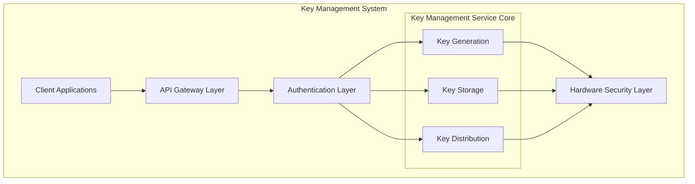

## System Components

### A. Hardware Security Layer
1. **Trusted Execution Environment (TEE)**
   - Secure key generation using hardware RNG
   - Protected key storage with encryption at rest
   - Isolated execution preventing memory access
   - Hardware-based attestation for identity verification
   
   ```plaintext
   TEE Security Boundaries:
   ┌────────────────────────────────────────┐
   │              TEE Environment            │
   │  ┌──────────────┐    ┌──────────────┐  │
   │  │  Secure      │    │  Protected    │  │
   │  │  Processing  │    │  Memory       │  │
   │  └──────────────┘    └──────────────┘  │
   │  ┌──────────────┐    ┌──────────────┐  │
   │  │  Key         │    │  Attestation  │  │
   │  │  Storage     │    │  Engine       │  │
   │  └──────────────┘    └──────────────┘  │
   └────────────────────────────────────────┘
   ```

2. **Hardware Security Modules (HSM)**
   - FIPS 140-2 Level 3 compliant
   - Physical tamper protection
   - Secure backup capabilities
   - Multi-factor authentication for admin access

### B. Software Security Layer
1. **Key Management Service**
   ```plaintext
   Service Components:
   ┌─────────────────┐
   │ Policy Engine   │
   ├─────────────────┤
   │ Access Control  │
   ├─────────────────┤
   │ Audit System    │
   ├─────────────────┤
   │ Key Lifecycle   │
   └─────────────────┘
   ```

2. **Security Monitoring System**
   - Real-time monitoring with ML-based anomaly detection
   - Centralized logging with encrypted transport
   - Automated alert correlation
   - Compliance reporting dashboard

## Key Hierarchy

### A. Key Types
1. **Master Keys (Root)**
   ```plaintext
   Master Key Properties:
   - Algorithm: AES-256-GCM
   - Storage: HSM only
   - Backup: Geographically distributed HSMs
   - Access: Quorum approval required (M-of-N)
   ```

2. **Key Encryption Keys (KEKs)**
   ```plaintext
   KEK Usage Flow:
   [Master Key] → [KEK Generation] → [KEK Distribution] → [Key Wrapping]
   ```

3. **Data Encryption Keys (DEKs)**
   ```plaintext
   DEK Lifecycle:
   1. Generation in TEE
   2. Encryption with KEK
   3. Distribution to services
   4. Regular rotation
   5. Secure destruction
   ```

4. **Authentication Keys**
   - RSA-4096 for asymmetric operations
   - ED25519 for signing
   - Rotation triggers: Time-based or on-demand

### B. Key Properties
```plaintext
Extended Key Metadata:
┌────────────────────┬────────────────────────┐
│ Property           │ Example                │
├────────────────────┼────────────────────────┤
│ ID                 │ key_123abc456          │
│ Creation Time      │ 2024-03-20T10:00:00Z   │
│ Expiration        │ 2024-04-20T10:00:00Z   │
│ Algorithm         │ AES-256-GCM            │
│ Purpose           │ Data Encryption        │
│ Owner             │ Service_A              │
│ Security Level    │ L3                     │
│ Rotation Schedule │ Monthly                │
└────────────────────┴────────────────────────┘
```

### Key Hierarchy and Relationships
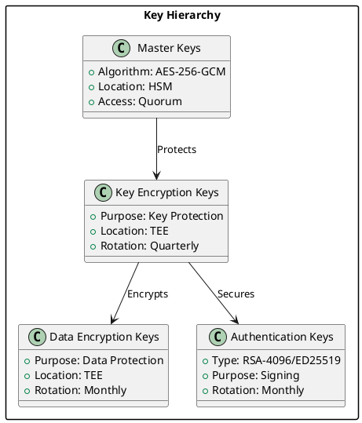

#### Mermaid Version
```mermaid
classDiagram
    class MasterKeys {
        +Algorithm: AES-256-GCM
        +Location: HSM
        +Access: Quorum
    }
    
    class KEK {
        +Purpose: Key Protection
        +Location: TEE
        +Rotation: Quarterly
    }
    
    class DEK {
        +Purpose: Data Protection
        +Location: TEE
        +Rotation: Monthly
    }
    
    class AuthKeys {
        +Type: RSA-4096/ED25519
        +Purpose: Signing
        +Rotation: Monthly
    }
    
    MasterKeys --> KEK : Protects
    KEK --> DEK : Encrypts
    KEK --> AuthKeys : Secures
}

## Security Implementation

### A. Key Generation
```plaintext
Generation Process:
1. Request validation
2. Authorization check
3. Entropy gathering
4. Key creation in TEE
5. Metadata assignment
6. Secure storage
7. Audit logging
```

### B. Key Storage
1. **Secure Storage Hierarchy**
   ```plaintext
   Storage Layers:
   [Hardware Security Module]
      ↓
   [Trusted Execution Environment]
      ↓
   [Encrypted Storage]
   ```

2. **Access Controls**
   ```plaintext
   Access Levels:
   - Level 0: View metadata only
   - Level 1: Use key
   - Level 2: Manage key
   - Level 3: Create/delete keys
   - Level 4: System administration
   ```

### C. Key Distribution
1. **Secure Channel Establishment**
   ```plaintext
   Distribution Steps:
   1. Identity verification
   2. Attestation check
   3. Channel encryption
   4. Key wrapping
   5. Secure transfer
   6. Receipt confirmation
   ```

2. **Cross-Platform Sharing**
   ```plaintext
   Sharing Process:
   1. Source authentication
   2. Target verification
   3. Key preparation
   4. Secure transfer
   5. Usage monitoring
   ```

### Security Implementation Flow
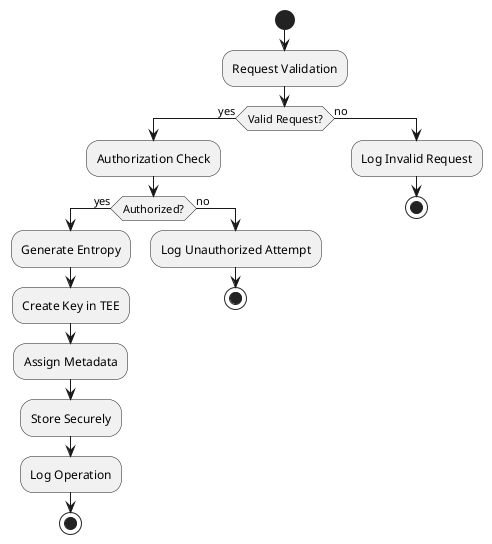

#### Mermaid Version
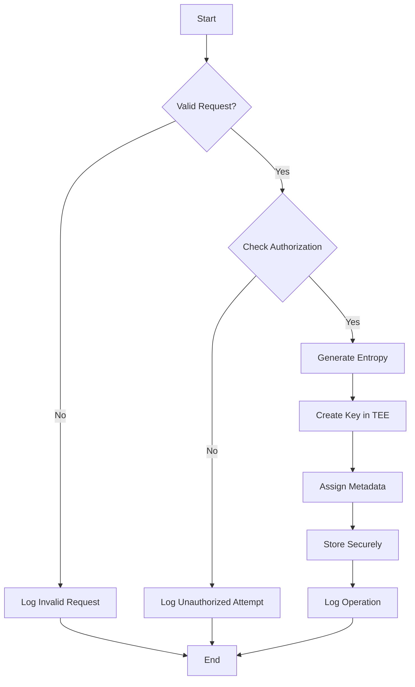

## End-to-End Flows

### A. Initial Setup Flow
```plaintext
System Bootstrap:
1. TEE initialization
2. Master key generation
3. Initial KEK creation
4. System identity establishment
5. Security policy activation
```

### B. Operational Flows

1. **New Client Onboarding**
   ```plaintext
   Onboarding Steps:
   1. Client registration
   2. Identity verification
   3. Key generation
   4. Access grant
   5. Initial key distribution
   ```

2. **Regular Operation**
   ```plaintext
   Operation Flow:
   1. Request authentication
   2. Permission verification
   3. Key retrieval
   4. Operation execution
   5. Activity logging
   ```

3. **Key Rotation**
   ```plaintext
   Rotation Process:
   1. New key generation
   2. Client notification
   3. Gradual transition
   4. Old key retirement
   5. Cleanup verification
   ```

### C. Emergency Procedures

1. **Key Compromise Response**
   ```plaintext
   Response Steps:
   1. Incident detection
   2. System isolation
   3. Emergency key rotation
   4. Client notification
   5. System recovery
   ```

2. **Disaster Recovery**
   ```plaintext
   Recovery Process:
   1. Backup validation
   2. System restoration
   3. Key regeneration
   4. Access restoration
   5. Operation verification
   ```

## Operational Procedures

### A. Regular Maintenance
1. **Daily Operations**
   - Access monitoring
   - Health checks
   - Backup verification
   - Log review

2. **Weekly Tasks**
   - Security audit review
   - Performance analysis
   - Policy compliance check
   - Incident review

3. **Monthly Activities**
   - Key rotation execution
   - System updates
   - Compliance reporting
   - Capacity planning

### B. Security Procedures
1. **Access Management**
   ```plaintext
   Access Control:
   - Identity verification
   - Permission management
   - Access logging
   - Regular review
   ```

2. **Audit Procedures**
   ```plaintext
   Audit Areas:
   - Key usage patterns
   - Access attempts
   - System changes
   - Security events
   ```

## Monitoring and Maintenance

### A. Security Monitoring
1. **Real-time Monitoring**
   ```plaintext
   Monitored Aspects:
   - Key usage
   - Access patterns
   - System health
   - Security events
   ```

2. **Alert System**
   ```plaintext
   Alert Levels:
   - Info: Regular operations
   - Warning: Unusual patterns
   - Error: System issues
   - Critical: Security threats
   ```

### B. Performance Metrics
1. **Key Performance Indicators**
   ```plaintext
   Metrics:
   - Response time
   - Key operation latency
   - System availability
   - Error rates
   ```

2. **Security Metrics**
   ```plaintext
   Security KPIs:
   - Failed access attempts
   - Key rotation compliance
   - Incident response time
   - System vulnerabilities
   ```

### C. Maintenance Procedures
1. **Regular Updates**
   - Security patches
   - System upgrades
   - Policy updates
   - Performance optimization

2. **System Health**
   - Capacity monitoring
   - Resource utilization
   - Performance trending
   - Health checks

### Monitoring and Alert System
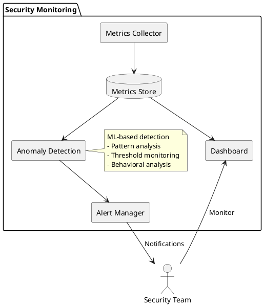

### Performance Monitoring Architecture
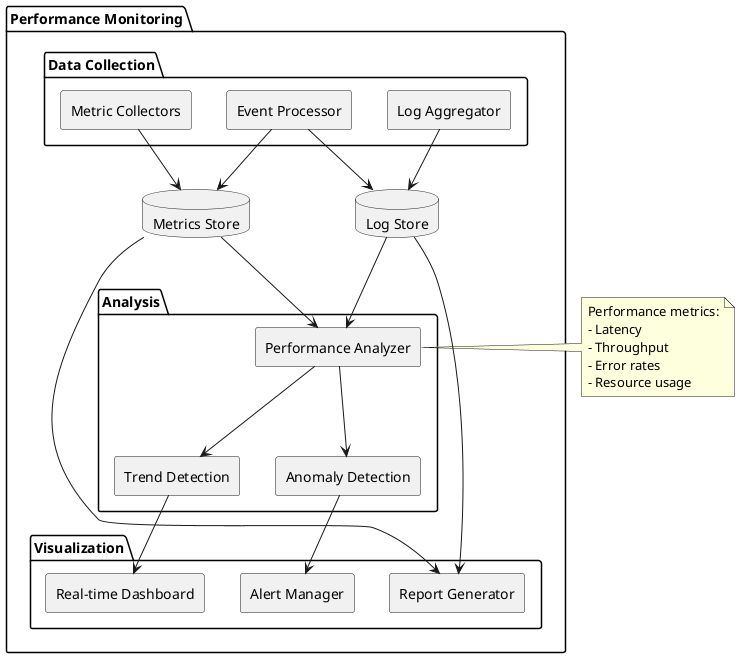

#### Mermaid Version
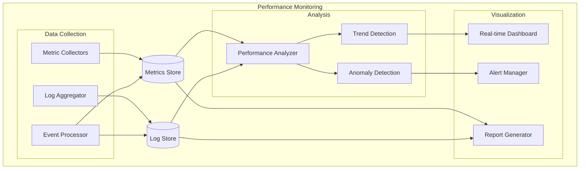

## Use Cases and Examples

### A. Ad Platform Integration
```plaintext
Scenario: Ad platform accessing user interests
┌──────────────┐    ┌──────────────┐    ┌──────────────┐
│ Ad Platform  │    │    KMS       │    │  TEE         │
└──────┬───────┘    └──────┬───────┘    └──────┬───────┘
       │                   │                    │
       │   Request Key     │                    │
       │─────────────────►│                    │
       │                   │    Generate Key    │
       │                   │───────────────────►│
       │                   │                    │
       │                   │   Return Key       │
       │                   │◄───────────────────│
       │   Return Key      │                    │
       │◄─────────────────│                    │
       │                   │                    │
```

### B. Cross-Platform Data Sharing
```plaintext
Example Flow:
1. Platform A requests data sharing with Platform B
2. KMS verifies both platforms' identities
3. Generates temporary sharing keys
4. Encrypts data with sharing key
5. Securely transfers to Platform B
6. Monitors usage and logs access
```

## Architecture Diagrams

### A. System Integration
```plaintext
┌─────────────┐     ┌─────────────┐     ┌─────────────┐
│ Ad Platform │     │ KMS Gateway │     │ Core KMS    │
└─────┬───────┘     └─────┬───────┘     └─────┬───────┘
      │                   │                    │
      │ HTTPS/TLS        │ Internal API       │
      ├──────────────────►├──────────────────►│
      │                   │                    │
      │                   │                    │
┌─────┴───────┐     ┌─────┴───────┐     ┌─────┴───────┐
│ Monitoring  │     │ Auth Service│     │ TEE/HSM     │
└─────────────┘     └─────────────┘     └─────────────┘
```

### B. Key Distribution Flow
```plaintext
┌────────────┐  1. Request   ┌────────────┐
│ Requesting │──────────────►│   KMS      │
│  Service   │              │  Service    │
└────────────┘              └──────┬─────┘
                                   │
                           2. Verify Auth
                                   │
                            ┌──────┴─────┐
                            │    TEE     │
                            │  Service   │
                            └──────┬─────┘
                                   │
                           3. Generate Key
                                   │
┌────────────┐  4. Return   ┌─────┴─────┐
│ Requesting │◄─────────────│   KMS     │
│  Service   │             │  Service   │
└────────────┘             └───────────┘
```

### Key Rotation Process
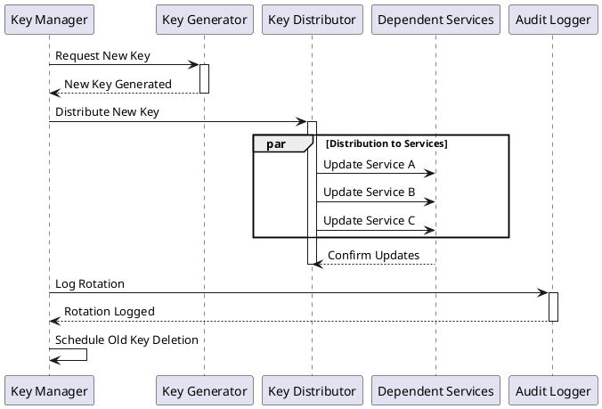

#### Mermaid Version
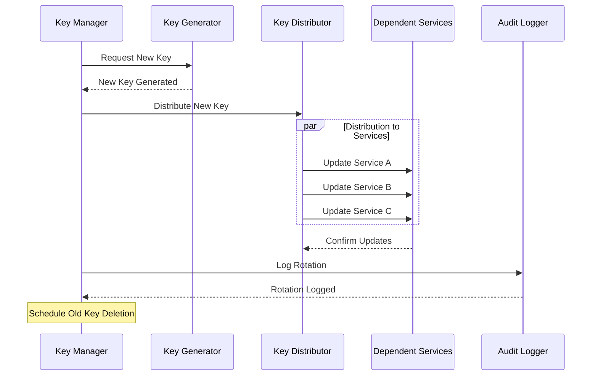

### Secure Channel Establishment
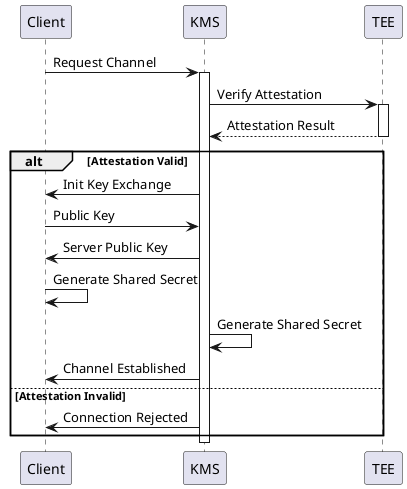

#### Mermaid Version
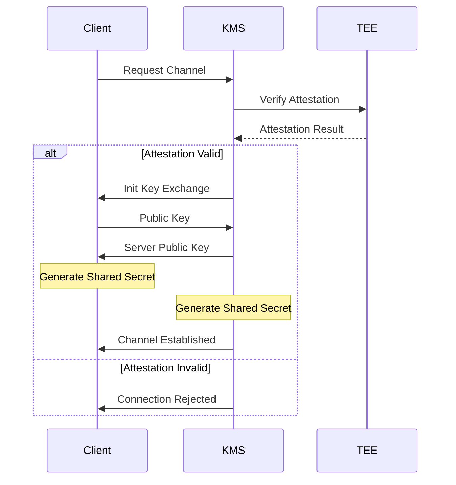

### Audit Logging System
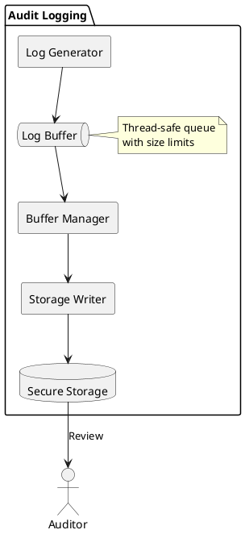

#### Mermaid Version
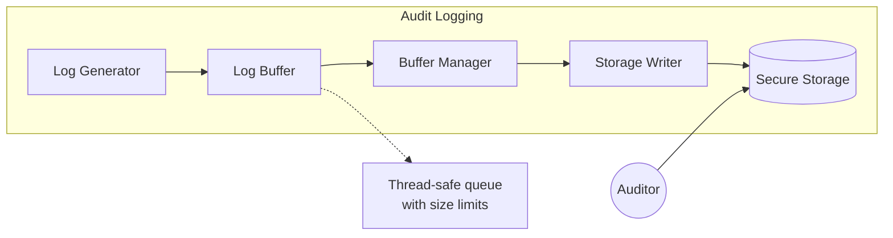

## Extended Use Cases

### C. Key Backup and Recovery
```plaintext
Scenario: Disaster recovery across regions

1. Regular Backup Process:
   ┌──────────────┐    ┌──────────────┐    ┌──────────────┐
   │ Primary KMS  │    │ Backup       │    │ Secondary    │
   │ Region       │───►│ Service      │───►│ Region       │
   └──────────────┘    └──────────────┘    └──────────────┘

   Backup Steps:
   1. Encrypt key material with backup KEK
   2. Generate backup metadata
   3. Replicate to secondary region
   4. Verify backup integrity
   5. Update backup audit log

2. Recovery Process:
   - Validate recovery authorization
   - Decrypt backup data
   - Verify key integrity
   - Restore to new HSM
   - Update key metadata
   - Verify functionality
```

### D. Compliance Auditing Scenario
```plaintext
Scenario: SOC 2 Compliance Audit

1. Pre-Audit Preparation:
   ┌─────────────┐    ┌─────────────┐    ┌─────────────┐
   │ Log         │    │ Audit       │    │ Report      │
   │ Collection  │───►│ Analysis    │───►│ Generation  │
   └─────────────┘    └─────────────┘    └─────────────┘

2. Audit Trail Generation:
   - Key lifecycle events
   - Access patterns
   - Policy changes
   - Security incidents
   - Performance metrics

3. Compliance Verification:
   - Access control review
   - Key rotation compliance
   - Incident response times
   - Security control effectiveness
```

### Backup and Recovery Architecture
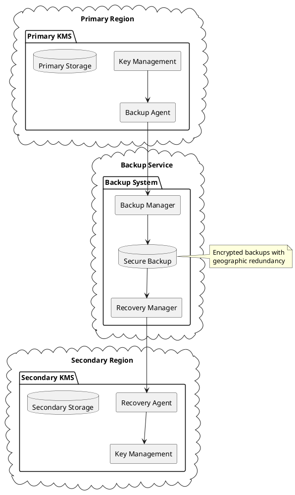

### Compliance Monitoring System
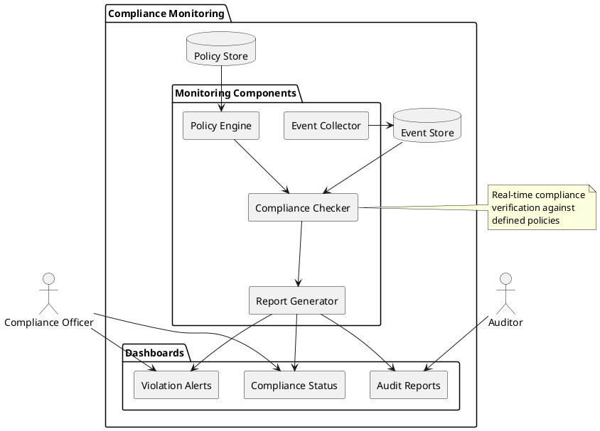

### Performance Monitoring Architecture


### Error Handling Flow
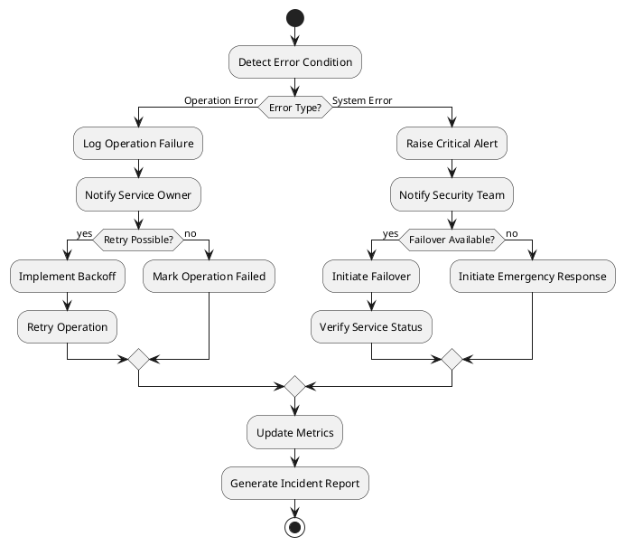

### Use Case Model
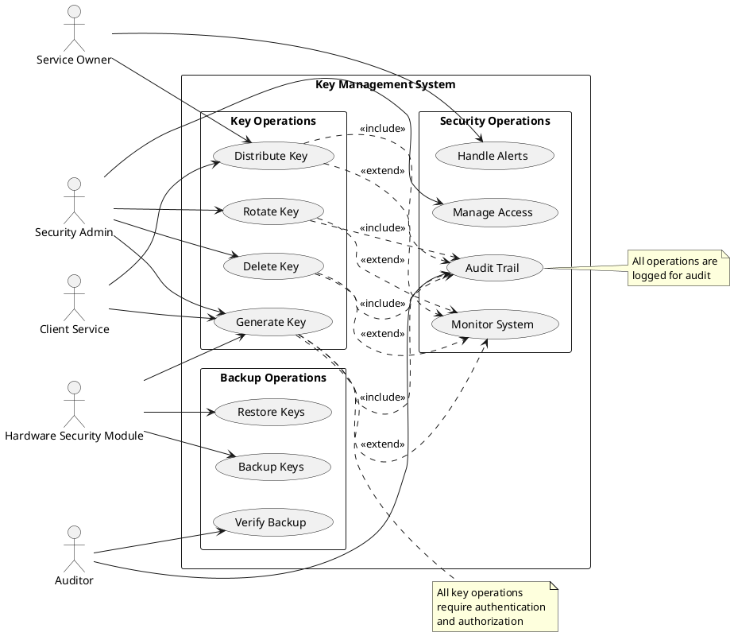

### Key Management Activity Diagrams

#### 1. Key Generation Activity
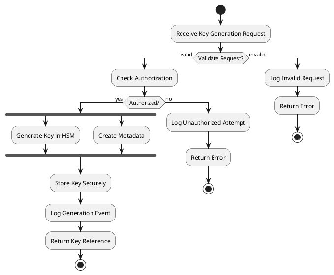

#### 2. Key Distribution Activity
```plantuml
@startuml
|Requesting Service|
start
:Submit Key Request;

|Key Management System|
:Validate Request;
if (Valid?) then (yes)
    :Check Authorization;
    if (Authorized?) then (yes)
        :Establish Secure Channel;
        fork
            :Prepare Key for Transport;
        fork again
            :Generate Audit Log;
        end fork
        :Transmit Key Securely;
        
        |Requesting Service|
        :Receive and Store Key;
        :Send Acknowledgment;
        
        |Key Management System|
        :Update Key Status;
        :Complete Audit Log;
        stop
    else (no)
        :Log Access Denial;
        :Return Error;
        stop
    endif
else (no)
    :Log Invalid Request;
    :Return Error;
    stop
endif
@enduml
```

#### 3. Key Rotation Activity
```plantuml
@startuml
|Key Manager|
start
:Initiate Key Rotation;

fork
    :Generate New Key;
fork again
    :Prepare Notification;
end fork

|Dependent Services|
:Receive Rotation Notice;

|Key Manager|
:Distribute New Key;

|Dependent Services|
:Acknowledge Receipt;
:Switch to New Key;

|Key Manager|
:Verify Key Switch;
if (All Services Switched?) then (yes)
    :Schedule Old Key Deletion;
    :Complete Rotation;
    stop
else (no)
    :Extend Grace Period;
    :Send Reminder;
    stop
endif
@enduml
```

#### 4. Emergency Response Activity
```plantuml
@startuml
|Monitoring System|
start
:Detect Security Event;

if (Severity Level?) then (Critical)
    :Trigger Emergency Response;
    
    fork
        |Security Team|
        :Assess Incident;
        :Isolate Affected Systems;
    fork again
        |Key Manager|
        :Prepare Emergency Keys;
        :Initialize Recovery Mode;
    end fork
    
    |Security Team|
    :Validate Recovery Plan;
    
    |Key Manager|
    :Execute Recovery;
    
    fork
        :Rotate Compromised Keys;
    fork again
        :Update Security Policies;
    fork again
        :Generate Incident Report;
    end fork
    
    |Security Team|
    :Verify System Status;
    :Resume Normal Operations;
    
else (Non-Critical)
    :Log Event;
    :Schedule Review;
    stop
endif

stop
@enduml
```

## Appendix

### A. Glossary
- **TEE**: Trusted Execution Environment - Secure hardware-based execution environment
- **HSM**: Hardware Security Module - Dedicated security hardware for key management
- **KEK**: Key Encryption Key - Used to encrypt other keys
- **DEK**: Data Encryption Key - Used for data encryption
- **Attestation**: Process of verifying TEE authenticity
- **Quorum**: Multiple approvers required for sensitive operations

### B. Reference Documents
1. Security Policies
   - Key Management Policy
   - Access Control Policy
   - Audit Policy
   - Incident Response Plan

2. Compliance Requirements
   - FIPS 140-2 Requirements
   - GDPR Compliance
   - SOC 2 Controls
   - ISO 27001 Standards

3. Emergency Procedures
   - Incident Response Playbook
   - Disaster Recovery Plan
   - Business Continuity Plan
   - Emergency Contact Protocol

4. Audit Guidelines
   - Security Audit Procedures
   - Compliance Audit Checklist
   - Performance Audit Guide
   - Risk Assessment Framework

### C. Contact Information
- **Security Team**
  - Security Operations: security-ops@example.com
  - Incident Response: incident-response@example.com
  
- **System Administrators**
  - KMS Administration: kms-admin@example.com
  - TEE Management: tee-admin@example.com
  
- **Emergency Response Team**
  - 24/7 Emergency: +1-xxx-xxx-xxxx
  - Escalation Contact: escalation@example.com
  
- **Compliance Officers**
  - Compliance Team: compliance@example.com
  - Audit Team: audit@example.com

### D. PlantUML Embedding Guide

There are several methods to embed PlantUML diagrams in Markdown:

1. **Basic Fenced Code Block**
   ```markdown
   ```plantuml
   @startuml
   Alice -> Bob: Hello
   Bob --> Alice: Hi there
   @enduml
   ```
   ```

2. **HTML Embedding**
   ```html
   <div class="plantuml">
   @startuml
   Alice -> Bob: Hello
   Bob --> Alice: Hi there
   @enduml
   </div>
   ```

3. **Using Image Links (requires PlantUML server)**
   ```markdown
   
   ```

4. **Inline SVG (if supported by your Markdown renderer)**
   ```markdown
   ```plantuml format="svg"
   @startuml
   Alice -> Bob: Hello
   Bob --> Alice: Hi there
   @enduml
   ```

#### Best Practices for PlantUML in Markdown:

1. **Diagram Organization**
   - Keep diagrams modular and focused
   - Use meaningful names for components
   - Add comments for complex diagrams

2. **Styling**
   - Use consistent styling across diagrams
   - Define common styles using skinparam
   - Consider using a style library

3. **Example with Styling**
   ```plantuml
   @startuml
   skinparam componentStyle rectangle
   skinparam backgroundColor transparent
   skinparam handwritten true
   
   Alice -> Bob: Hello
   Bob --> Alice: Hi there
   @enduml
   ```

4. **Version Control**
   - Store diagrams in version control
   - Use text-based format for easy diffing
   - Consider using include files for common elements

Note: The rendering of these diagrams depends on your Markdown viewer/platform's PlantUML support. 

### E. Browser-Compatible Diagrams with Mermaid.js

For better browser compatibility, you can use Mermaid.js instead of PlantUML. Here's how to convert the diagrams:

1. **Basic Sequence Diagram**
   ```mermaid
   sequenceDiagram
       Alice->>Bob: Hello
       Bob-->>Alice: Hi there
   ```

2. **Component Diagram**
   ```mermaid
   graph TD
       A[Client Applications] --> B[API Gateway]
       B --> C[Authentication Layer]
       C --> D[Key Management Core]
       D --> E[Hardware Security]
   ```

3. **Activity Diagram**
   ```mermaid
   graph TD
       A[Start] --> B{Validate Request}
       B -->|Valid| C{Check Auth}
       B -->|Invalid| D[Log Error]
       C -->|Authorized| E[Generate Key]
       C -->|Unauthorized| F[Log Denial]
       E --> G[Store Key]
       G --> H[End]
   ```

4. **State Diagram**
   ```mermaid
   stateDiagram-v2
       [*] --> Pending
       Pending --> Processing: Validate
       Processing --> Active: Authorized
       Processing --> Failed: Unauthorized
       Active --> [*]
       Failed --> [*]
   ```

#### Converting PlantUML to Mermaid

1. **Component Diagrams**
   - PlantUML:
     ```plantuml
     @startuml
     [Component A] --> [Component B]
     @enduml
     ```
   - Mermaid:
     ```mermaid
     graph LR
         A[Component A] --> B[Component B]
     ```

2. **Sequence Diagrams**
   - PlantUML:
     ```plantuml
     @startuml
     Alice -> Bob: Hello
     Bob --> Alice: Hi
     @enduml
     ```
   - Mermaid:
     ```mermaid
     sequenceDiagram
         Alice->>Bob: Hello
         Bob-->>Alice: Hi
     ```

#### Browser Support
- Mermaid.js works natively in:
  - GitHub Markdown
  - GitLab Markdown
  - Modern browsers with JavaScript enabled
  - VS Code with Markdown Preview
  - Many documentation platforms

#### Integration Steps
1. Add Mermaid.js to your HTML:
   ```html
   <script src="https://cdn.jsdelivr.net/npm/mermaid/dist/mermaid.min.js"></script>
   <script>mermaid.initialize({startOnLoad:true});</script>
   ```

2. Use in Markdown:
   ````markdown
   ```mermaid
   graph TD
       A-->B
   ```
   ````

Note: If you're using a static site generator or documentation platform, check their Mermaid.js integration options. 